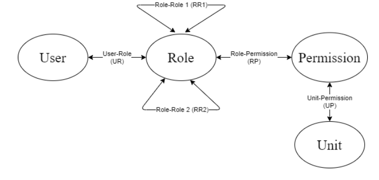

.. Flask-DynRBAC documentation master file, created by
   sphinx-quickstart on Fri Feb 28 17:30:24 2020.
   You can adapt this file completely to your liking, but it should at least
   contain the root `toctree` directive.

Welcome to Flask-DynRBAC's documentation!
=========================================

**ATTENTION**: this extension is still WIP. Use at your own risk.

Flask-DynRBAC is a Flask extension which allows for dynamic
role based access control and management, which is based on
database lookups and stores::

   # No hard-coded roles!
   @rbac()
   def func():
      # logic goes here

Role and permission management can be done manually or via
the pluggable API.

.. toctree::
   :maxdepth: 2
   :caption: Contents:

Installing and requirements
===========================

This extension relies on SQLAlchemy to work properly, and the
optional HTTP API requires the Flask-RESTful extension.

.. note:: PyPI extension upload will be done soon.

Minimal installation (without API)
----------------------------------
::

    pip install git+https://github.com/parkanaur/flask-dynrbac

Full installation
-----------------
::

    pip install flask-restful
    pip install git+https://github.com/parkanaur/flask-dynrbac

Initializing and configuring extension
======================================

The extension's constructor accepts various required and optional parameters.
You can either bind your app to the extension's instance directly via the
constructor or you can use `init_app()`.

.. automodule:: flask_dynrbac
   :members:

Initialization example
----------------------
::

   from flask import Flask
   from .models import User, Unit, Role, Permission
   from .db import db # Flask-SQLAlchemy instance
   from flask_dynrbac import DynRBAC
   from .session import get_current_user_id

   app = Flask(__name__)
   app.config['SQLALCHEMY_DATABASE_URI'] = 'sqlite:///test.db'
   db.init_app(app)

   rbac = DynRBAC(app, session=db.session, user_id_provider=get_current_user_id,
       role_class=Role, permission_class=Permission, user_class=User, unit_class=Unit)

   # Alternate way:
   rbac = DynRBAC(session=db.session, user_id_provider=get_current_user_id,
       role_class=Role, permission_class=Permission, user_class=User, unit_class=Unit)
   rbac.init_app(app)

Entity classes and relationships
================================
The domain model is comprised of four SQLAlchemy entities: `User`, `Unit`, `Permission`, and `Role`.
Each entity has a list of attributes (i.e. SQLAlchemy columns/relationships) necessary for the extension to
work properly.

Primarily, an ID column is required in each entity, as well as relationships between entities according to the domain
model.

Alternatively, you can use :class:`flask_dynrbac.domain_model_generator.DomainModelGenerator` to automatically
create all domain model classes and relationships.

.. note:: Refer to :class:`flask_dynrbac.domain_model_generator.DomainModelGenerator` source code for more details.

User
----
:ID

Role
----

Permission
----------

Unit
----

Domain Model Generator
======================

You can use :class:`flask_dynrbac.domain_model_generator.DomainModelGenerator` in order to expand
or create new entity classes that fit into your domain model.
Alternatively, you can simply copy and paste
the domain models' source code into your classes.

In order to use a default domain model, create an instance of `DomainModelGenerator`
with declarative base as a constructor argument (SQLAlchemy's `declarative_base` or
Flask-SQLAlchemy's `SQLAlchemy.model`)::

   from flask import Flask
   from flask_sqlalchemy import SQLAlchemy
   from flask_dynrbac import DynRBAC
   from flask_dynrbac.domain_model_generator import DomainModelGenerator

   app = Flask(__name__)
   app.config['SQLALCHEMY_DATABASE_URI'] = 'sqlite:///test.db'
   db = SQLAlchemy(app)

   # Init domain model
   models = DomainModelGenerator(db.Model)
   db.create_all()

   # Init RBAC
   rbac = DynRBAC(app, role_class=models.Role, user_class=models.User, permission_class=models.Permission,
                  session=db.session, user_id_provider=lambda: current_user_id, unit_class=models.Unit)

.. automodule:: flask_dynrbac.domain_model_generator
   :members:

Using extension
===============

All the work is done by the :meth:`flask_dynrbac.DynRBAC.rbac` decorator. Upon
applying the decorator to a route, the function is registered in the extension's
internal dictionary. If `create_missing_units` parameter is set to True, the decorator
will also create a record for that function in the database, and if `create_permission_for_missing_units`
parameter is True, a permission for that new function will be created.

Function registration examples
------------------------------
::

    ### some_routes.py

    # No protection
    @app.route('/')
    def basic():
        return 'Hello World!'

    # Implied unit name: some_routes_unit1
    @app.route('/unit1')
    @rbac.rbac()
    def unit1():
        return 'Hello World!'

    # Customized protection: include hierarchy check,
    # throw HTTP 404 on failed check
    @app.route('/unit2')
    @rbac.rbac(unit_name='unit2_custom', check_hierarchy=True, error_code=404)
    def unit2():
        return 'Hello World!'

.. automodule:: flask_dynrbac.exc
   :members:

Optional HTTP JSON API
======================

Indices and tables
==================

* :ref:`genindex`
* :ref:`modindex`
* :ref:`search`
